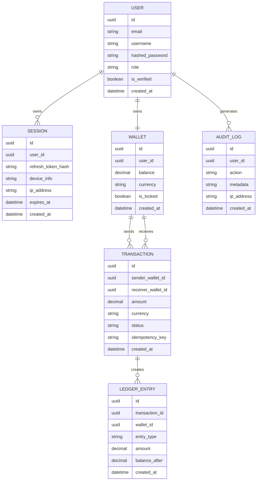
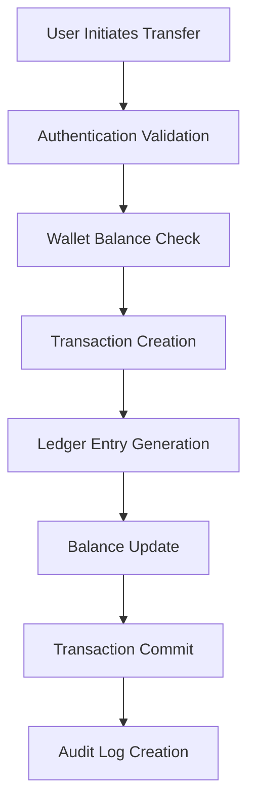

# OpenPayStack Architecture

## Overview

OpenPayStack is an open-source financial systems sandbox focused on backend architecture, payment orchestration, security engineering, and distributed systems learning.

The project is designed to simulate production-inspired financial infrastructure while remaining educational and extensible.

---

# Core Philosophy

The goal is NOT to build a real banking platform.

The goal IS to:
- understand financial system architecture
- explore backend engineering deeply
- simulate secure transaction flows
- study distributed systems behavior
- learn attack mitigation techniques
- build production-inspired infrastructure

---

# Initial Architecture Style

## Modular Monolith

The project will begin as a modular monolith architecture.

Reason:
- simpler development
- easier debugging
- cleaner learning process
- reduced operational complexity

Microservices will only be introduced later if scaling and system boundaries justify them.

---

# Core System Modules

## 1. Authentication Module

Responsible for:
- user registration
- login/logout
- JWT authentication
- refresh token lifecycle
- session tracking
- RBAC (role-based access control)

### Topics Covered
- Sessions
- JWT
- Cookies
- Refresh Tokens
- Password Hashing
- Authentication Security

---

## 2. Wallet Module

Responsible for:
- user balances
- deposits
- transfers
- balance validation
- wallet locking

### Topics Covered
- ACID transactions
- Concurrency handling
- Balance consistency
- Transaction safety

---

## 3. Ledger Module

Responsible for:
- immutable financial records
- transaction history
- double-entry accounting
- reconciliation support

### Topics Covered
- Ledger systems
- Financial consistency
- Auditability
- Immutable records

---

## 4. Payment Orchestrator

Responsible for:
- transaction flow management
- payment routing simulation
- retries
- transaction states
- idempotency

### Topics Covered
- Payment orchestration
- Retry mechanisms
- Distributed systems
- Idempotent APIs

---

## 5. Security Lab

Responsible for:
- attack simulation
- vulnerability testing
- defensive implementation

### Planned Attack Simulations
- SQL Injection
- XSS
- CSRF
- Replay attacks
- JWT tampering
- Brute force attacks
- Rate-limit bypass attempts

---

## 6. Observability Module

Responsible for:
- centralized logging
- metrics
- tracing
- monitoring

### Topics Covered
- Reliability engineering
- Debugging
- Incident analysis
- Monitoring systems

---

# Core Entities

## User

Represents platform identity and authentication ownership.

### Fields
- id
- email
- username
- hashed_password
- role
- is_verified
- created_at

### Security Notes
Passwords are NEVER stored in plain text.

Only hashed passwords will be stored using secure hashing algorithms.

---

## Session

Represents authentication lifecycle and device tracking.

### Fields
- id
- user_id
- refresh_token_hash
- device_info
- ip_address
- expires_at
- created_at

### Security Notes
Refresh tokens will be hashed before storage to reduce token theft risk if the database is compromised.

---

## Wallet

Represents a financial balance container.

### Fields
- id
- user_id
- balance
- currency
- is_locked
- created_at

### Security Notes
The backend remains the source of truth for balances at all times.

Frontend balances are never trusted.

---

## Transaction

Represents a transfer attempt between wallets.

### Fields
- id
- sender_wallet_id
- receiver_wallet_id
- amount
- currency
- status
- idempotency_key
- created_at

### Important Concept
Idempotency prevents duplicate transaction execution during retries or repeated requests.

---

## LedgerEntry

Represents immutable financial history records.

### Fields
- id
- transaction_id
- wallet_id
- entry_type
- amount
- balance_after
- created_at

### Important Concept
Ledger entries should become immutable after creation to preserve audit integrity.

---

## AuditLog

Tracks sensitive system activity and security-related events.

### Fields
- id
- user_id
- action
- metadata
- ip_address
- created_at

### Purpose
Supports:
- security investigations
- fraud analysis
- operational tracing
- compliance-oriented logging

---

# Entity Relationship Diagram



---

# Initial Transaction Flow



---

# Planned Technology Stack

| Category | Technology |
|---|---|
| Backend | FastAPI |
| Database | PostgreSQL |
| Cache | Redis |
| Queue System | RabbitMQ |
| Containerization | Docker |
| Reverse Proxy | NGINX |
| Monitoring | Prometheus + Grafana |

---

# Security Principles

The project will follow security-first development practices:

- secure password hashing
- token lifecycle management
- backend authority validation
- secure session handling
- attack simulation in isolated environments
- audit logging
- least privilege access control

---

# Development Lifecycle

Every major feature will follow:

```text
Build
→ Attack
→ Analyze
→ Fix
→ Harden
→ Scale
→ Observe
```

This workflow is intended to simulate real backend and security engineering practices.

---

# Disclaimer

OpenPayStack is an educational engineering project.

It does NOT:
- process real money
- connect to banking systems
- integrate with real payment rails

All attack simulations and security experiments are intended only for controlled local environments.